# AUDIT

Артефакты, все выкладки были взяты из [artifacts/audit_category](./artifacts/audit_category).

## Датасет

- дневной ряд слишком шумный для сценария планирования - неделя ближе к реальному циклу планирования
- основной уровень агрегации тут category
- target берем в штуках, не в выручке, чтобы не смешивать спрос и ценовой эффект

## Запуск аудита

```bash
mt audit --manifest manifests/audit_category.yaml
```

Что где лежит:

- манифест аудита: [manifests/audit_category.yaml](./manifests/audit_category.yaml)
- исходные данные: [data/m5-forecasting-accuracy](./data/m5-forecasting-accuracy)
- артефакты аудита по категории: [artifacts/audit_category](./artifacts/audit_category)

Минимально что делает запуск:

- читает сырые таблицы M5
- агрегирует daily в weekly
- проверяет сетку и историю
- считает диагностические метрики
- сохраняет таблицы, графики и markdown-отчет

## Сводка по данным

| Метрика                      |                     Значение |
|------------------------------|-----------------------------:|
| Уровень агрегации            |                   `category` |
| Исходная частота             |                      `daily` |
| Рабочая частота              |             `weekly (W-MON)` |
| Период                       | `2011-01-24` .. `2016-05-16` |
| Число рядов                  |                          `3` |
| Число категорий              |                          `3` |
| Длина истории, медиана       |                 `278` недель |
| Средняя доля нулей           |                     `0.0000` |
| Средняя доля пропусков       |                     `0.0000` |
| Средняя доля выбросов        |                     `0.0036` |
| Средний коэффициент вариации |                     `0.1801` |
| Средняя сила тренда          |                     `2.6837` |
| Средняя ACF на лаге 52       |                     `0.5865` |
| Полнота недельной сетки      |                     `1.0000` |

- `zero_share` - доля недель с нулевыми продажами. Если высокая, ряд прерывистый
- `missing_share` - доля пропусков. Если высокая, лаги и rolling могут считаться криво
- `outlier_share` - доля аномальных точек. Нужно понимать, не тащат ли они модель
- `CV` / `coefficient_of_variation` - относительная шумность ряда. Чем выше, тем ряд менее стабильный
- `trend_strength` - насколько в ряду заметен тренд
- `ACF lag 13/26/52` - насколько ряд похож сам на себя через 13, 26 и 52 недели
- `weekly_grid_complete_share` - полная ли недельная сетка без дыр
- `stationarity_hint` - грубая подсказка, ряд скорее стационарный или нет

- [dataset_profile.csv](./artifacts/audit_category/dataset/dataset_profile.csv)
- [REPORT.md](./artifacts/audit_category/REPORT.md)
- [diagnostic_summary.csv](./artifacts/audit_category/diagnostics/diagnostic_summary.csv)
- [data_audit_summary.csv](./artifacts/audit_category/dataset/data_audit_summary.csv)

## Этапы анализа

### 1. Проверка источника и границ постановки

Фиксация того, что есть:

| Что проверяли     | Как проверяли                                  | Что получили                            | Комментарий                                         |
|-------------------|------------------------------------------------|-----------------------------------------|-----------------------------------------------------|
| Источник данных   | M5: `sales_train_*`, `calendar`, `sell_prices` | сырые таблицы читаются норм             | чтобы не строить pipeline на выдуманном наборе      |
| Target            | `sales_units`                                  | продажи в штуках                        | основная постановка, выручка отдельно               |
| Уровень агрегации | `category`                                     | 3 ряда: `FOODS`, `HOBBIES`, `HOUSEHOLD` | так меньше шума и это основной контур               |
| Частота           | `daily -> weekly`                              | якорь `W-MON`                           | дальше все лаги и backtesting живут в одной частоте |

- [data_dictionary.csv](./artifacts/audit_category/dataset/data_dictionary.csv)
- [dataset_profile.csv](./artifacts/audit_category/dataset/dataset_profile.csv)
- папка [dataset](./artifacts/audit_category/dataset)

### 2. Преобразование в недельную панель

Дневные продажи суммируем в недели
Алгоритм: недельная продажа = сумма дневных продаж внутри недели

| Что делали             | Формула / правило                              | Результат                                                |
|------------------------|------------------------------------------------|----------------------------------------------------------|
| Перевод daily в weekly | `y(s,w) = sum(sales(s,d))` по всем дням недели | получено `278` недель                                    |
| Проверка частоты       | `W-MON`                                        | недельная сетка единая                                   |
| Сравнение частот       | daily / weekly / monthly                       | weekly дал ниже CV (`0.1527`) и выше autocorr (`0.8452`) |

На недельном уровне ряд стабильнее, сезонность читается лучше, для горизонта `1..8` недель это просто логичнее
А daily шумнее, хуже читается сезонная память, и это хуже бьется с плановым сценарием проекта

- [aggregation](./artifacts/audit_category/aggregation)
- [aggregation_comparison.csv](./artifacts/audit_category/aggregation/aggregation_comparison.csv)

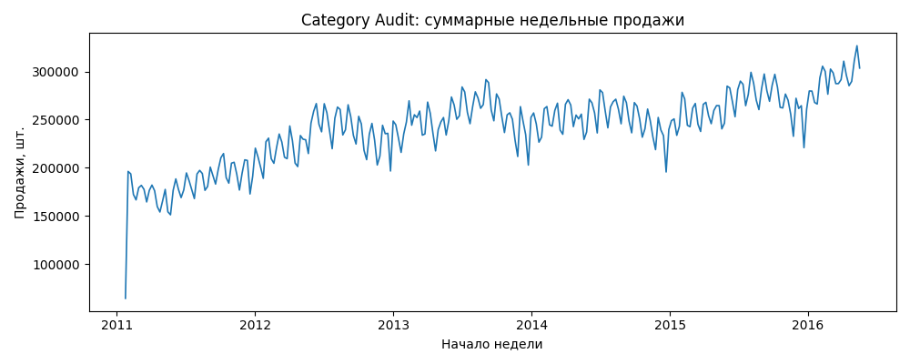

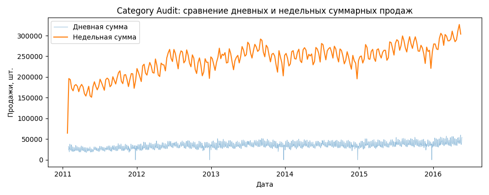


### 3. Проверка полноты панели и истории

Перед лагами убеждаемся, что у рядов нет дыр:

| Что проверяли           | Метрика                      |         Факт |
|-------------------------|------------------------------|-------------:|
| Полнота недельной сетки | `weekly_grid_complete_share` |     `1.0000` |
| Покрытие каждой серии   | `grid_coverage`              | `1.0` у всех |
| Длина истории           | `history_weeks`              | `278` у всех |
| Короткие истории        | `short_history_share`        |        `0.0` |
| Пропуски                | `missing_share_mean`         |        `0.0` |

Без полной панели нельзя честно считать лаги, rolling и rolling backtesting

- [data_audit_summary.csv](./artifacts/audit_category/dataset/data_audit_summary.csv)
- [history_length_distribution.png](./artifacts/audit_category/diagnostics/history_length_distribution.png)
- [missing_share_distribution.png](./artifacts/audit_category/diagnostics/missing_share_distribution.png)

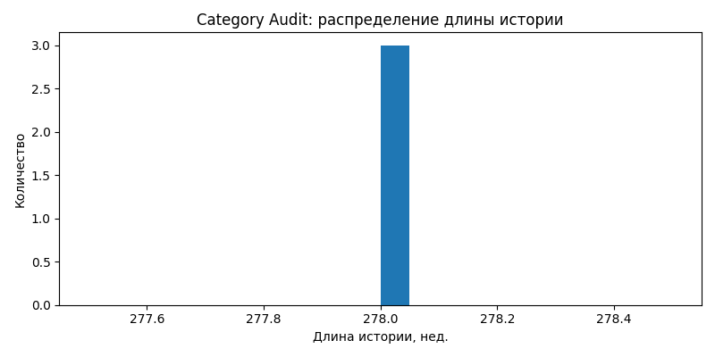

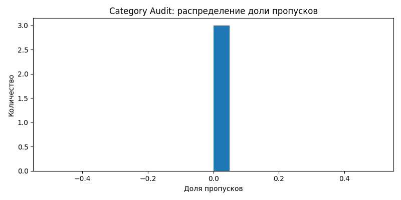

### 4. Target и грубая диагностика рядов

Смотрим, насколько ряды шумные, есть ли нули, выбросы, сильный перекос по масштабу

| Серия       | Сумма продаж | Среднее за неделю |       CV | Доля нулей | Доля выбросов |
|-------------|-------------:|------------------:|---------:|-----------:|--------------:|
| `FOODS`     | `45,922,427` |      `165,188.59` | `0.1461` |   `0.0000` |      `0.0036` |
| `HOBBIES`   |  `6,240,656` |       `22,448.40` | `0.1655` |   `0.0000` |      `0.0036` |
| `HOUSEHOLD` | `14,764,090` |       `53,108.24` | `0.2287` |   `0.0000` |      `0.0036` |

Коротко:

- нулевой спрос на уровне категории почти не проблема
- ряды не прерывистые
- масштаб категорий разный, но не экстремально
- шум есть, но не такой, чтобы baseline c бесполезен

- [category_summary.csv](./artifacts/audit_category/dataset/category/category_summary.csv)
- папка [diagnostics](./artifacts/audit_category/diagnostics)

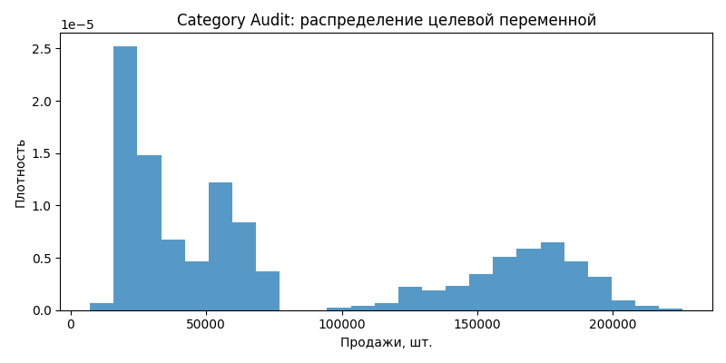

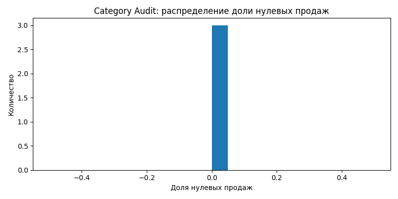

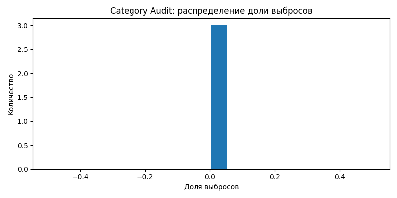

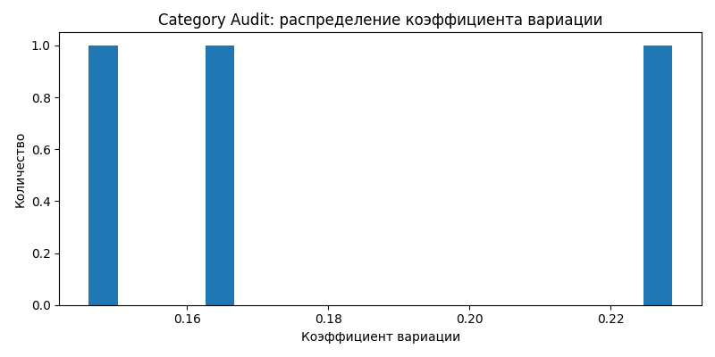

### 5. Сезонность, тренд, стационарность

Проверяем, есть ли память в ряду.
Если памяти нет, сложные лаги и seasonal baseline слабо оправданы.
Если память есть, baseline Seasonal Naive обязателен.

| Метрика                           | Значение | Вывод                                   |
|-----------------------------------|---------:|-----------------------------------------|
| `ACF lag 13 mean`                 | `0.7738` | есть квартальная память                 |
| `ACF lag 26 mean`                 | `0.7002` | есть полугодовая память                 |
| `ACF lag 52 mean`                 | `0.5865` | годовая сезонность заметная             |
| `strong_seasonality_share_lag_52` |    `1.0` | Seasonal Naive обязателен               |
| `mean_trend_strength`             | `2.6837` | чисто плоский ряд тут не предполагается |

Отдельно по стационарности:

| Серия       | ADF p-value | KPSS p-value | Подсказка               |
|-------------|------------:|-------------:|-------------------------|
| `FOODS`     |    `0.1093` |       `0.01` | `likely_non_stationary` |
| `HOBBIES`   |    `0.4588` |       `0.01` | `likely_non_stationary` |
| `HOUSEHOLD` |    `0.5646` |       `0.01` | `likely_non_stationary` |

Если ряды нестационарные, нельзя автоматически считать, что одна статистическая модель закроет все. Нужны baseline, статистика и ML в сравнении

- [diagnostic_summary.csv](./artifacts/audit_category/diagnostics/diagnostic_summary.csv)
- [seasonality_summary.csv](./artifacts/audit_category/diagnostics/seasonality_summary.csv)
- [stationarity_summary.csv](./artifacts/audit_category/diagnostics/stationarity_summary.csv)

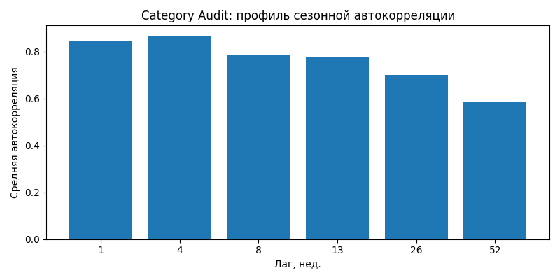

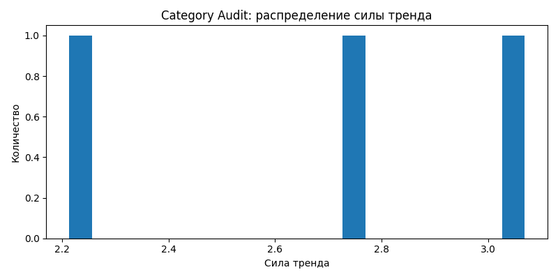


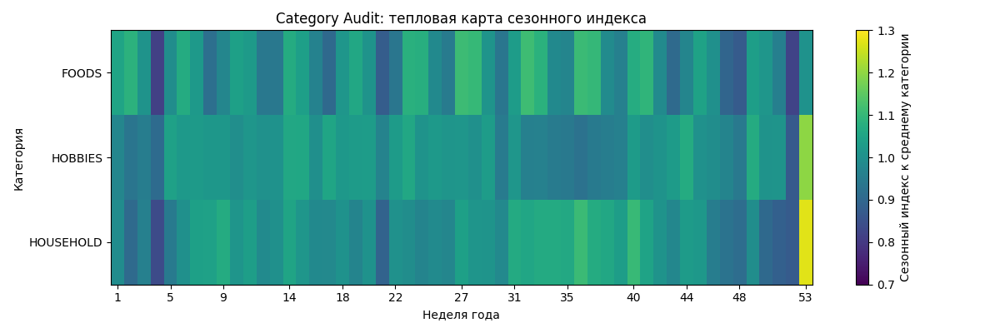

### 6. Сегментация рядов

Делим ряды по поведению, чтобы потом понимать, где модель реально сильна, а где просто средняя температура.

| Сегмент  | Число рядов |  Доля | Средняя доля нулей |
|----------|------------:|------:|-------------------:|
| `stable` |         `3` | `1.0` |              `0.0` |

На уровне `category` данные ровные.

- [segment_summary.csv](./artifacts/audit_category/diagnostics/segment_summary.csv)

### 7. Анализ признаков и контроль утечки

Главный фильтр. Признак берем только если он реально известен на дату прогноза:

| Признак                   | Класс              | Берем / не берем           | Почему                                                              |
|---------------------------|--------------------|----------------------------|---------------------------------------------------------------------|
| `category`                | `static` / known   | берем                      | идентичность ряда                                                   |
| `week_start`              | time index / known | берем                      | календарь известен заранее                                          |
| `sales_units` lag/rolling | observed history   | берем                      | прошлое, его можно знать                                            |
| `price`                   | `future_unknown`   | не берем в базовом контуре | историческая цена есть, будущая на forecast origin не гарантирована |
| `promo`                   | `future_unknown`   | не берем                   | в сыром виде отсутствует                                            |

Иначе backtesting будет фикцией, модель начнет подглядывать в будущее

- [transformation_summary.csv](./artifacts/audit_category/features/transformation_summary.csv)
- пример фичей: [example_feature_snapshot.csv](./artifacts/audit_category/example_series/category/foods/example_feature_snapshot.csv)
- папка с примерами рядов: [example_series/category/foods](./artifacts/audit_category/example_series/category/foods)

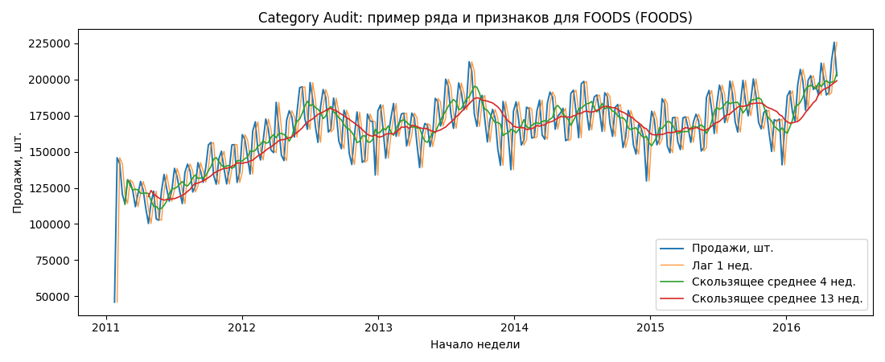

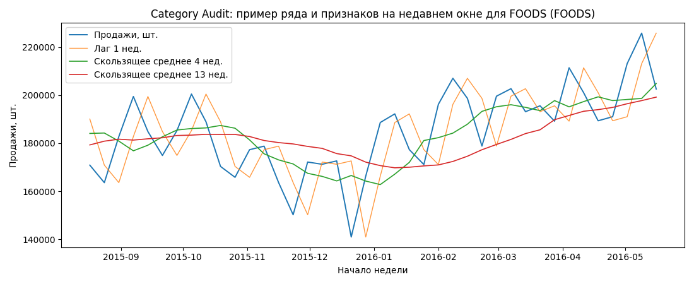

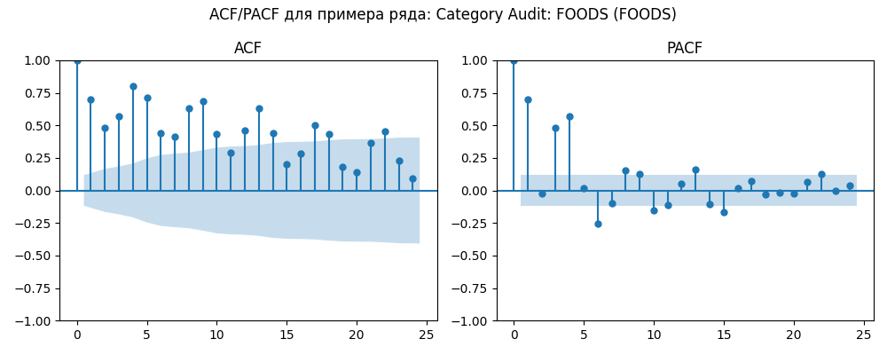

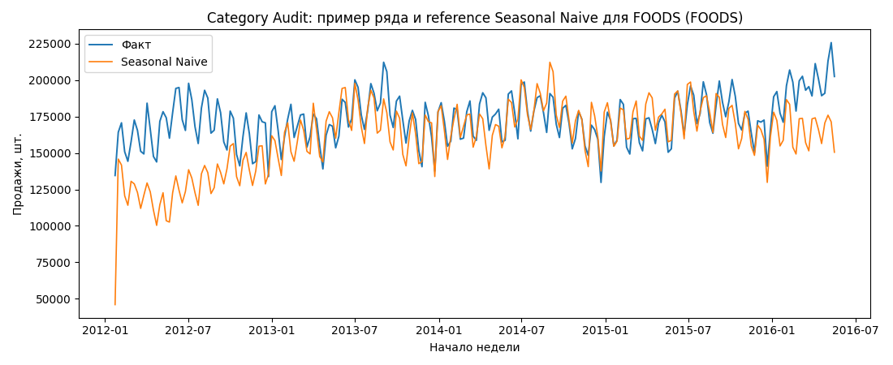

### 8. Для моделирования

- baseline `Naive` и `Seasonal Naive` обязательны
- недельный `category`-контур выглядит корректным и достаточно чистым для честного сравнения моделей
- сильная сезонность оправдывает лаги `13/26/52` и seasonal baseline
- нули и пропуски не являются главной проблемой на этом уровне
- по признакам базовый безопасный набор: лаги + rolling + календарь + статические признаки ряда

## Итог

Данные на уровне `category` для недельного прогнозирования норм:

- сетка полная
- история длинная
- пропусков нет
- нулей нет
- сезонность есть
- baseline Seasonal Naive обязателен.

Для базовой постановки разумно идти дальше с лагами, rolling и календарем
