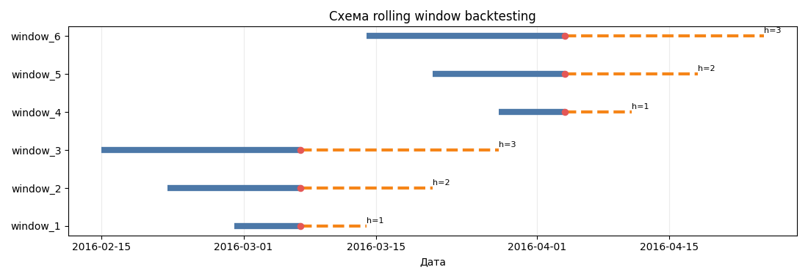
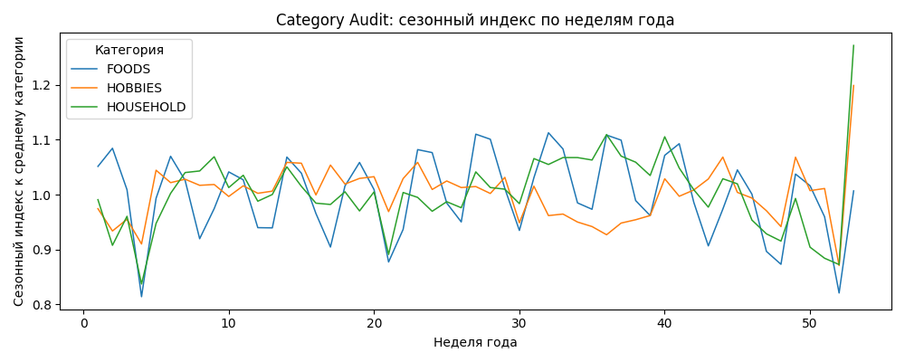
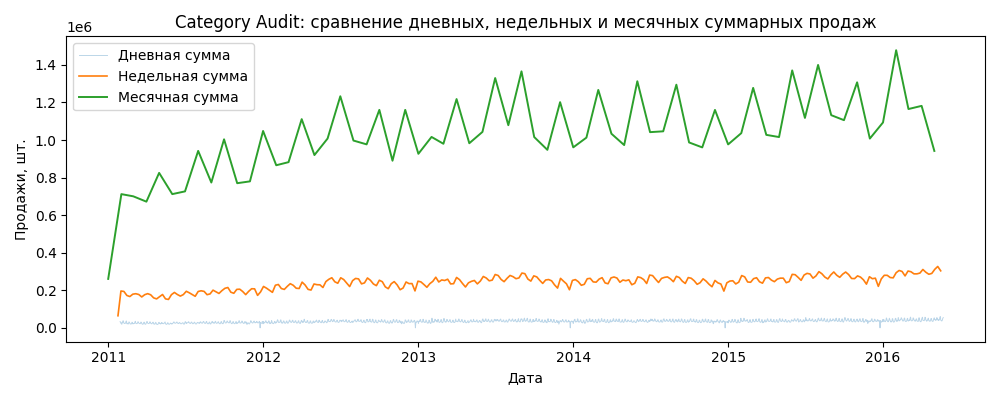
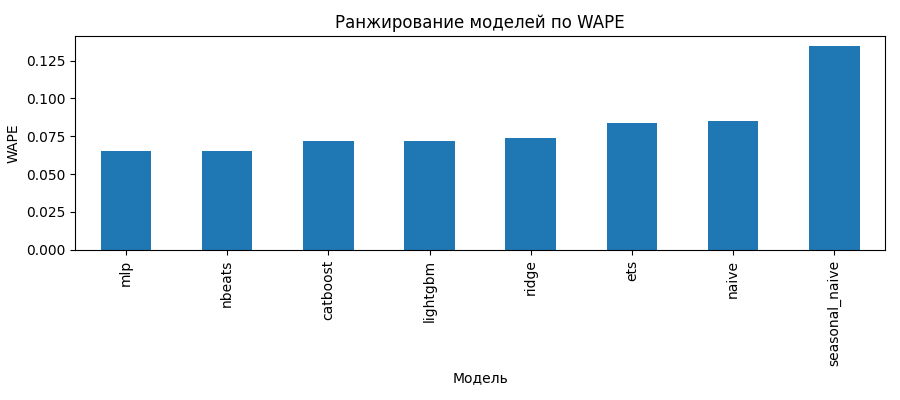
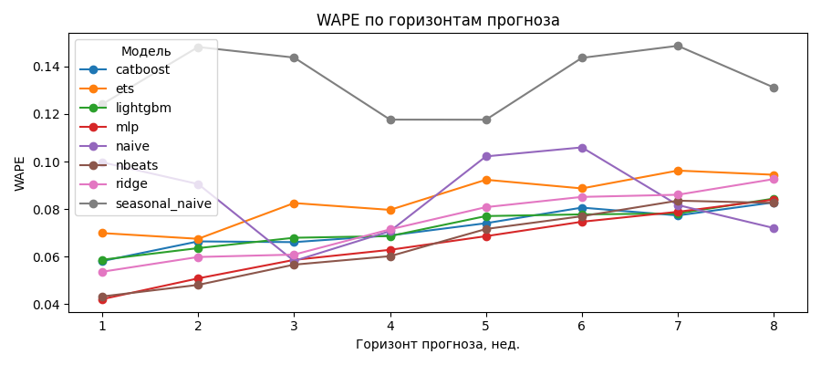
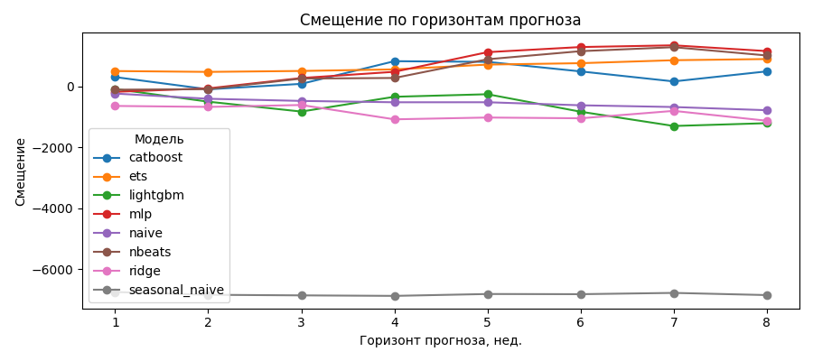
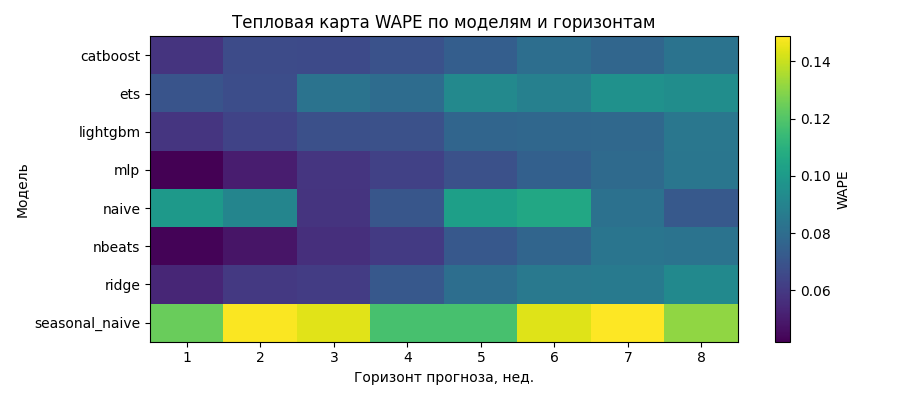

# experiment_category

Рабочая запись по полному эксперименту `experiment_category`

## Эксперимент

| Пункт                       | Что принято                                                                |
|-----------------------------|----------------------------------------------------------------------------|
| Датасет                     | `M5 Forecasting Accuracy`, путь: `data/m5-forecasting-accuracy`            |
| Основной target             | недельные продажи в штуках, `sales_units`                                  |
| Частота                     | weekly, якорь недели `W-MON`                                               |
| Уровень агрегации           | `category`                                                                 |
| Ряды                        | `FOODS`, `HOBBIES`, `HOUSEHOLD`                                            |
| Горизонт                    | `1..8` недель                                                              |
| Валидация                   | только `rolling window backtesting`                                        |
| Базовый контур по признакам | без цены и без промо                                                       |
| Обязательный baseline       | `Seasonal Naive`                                                           |
| Манифест                    | [`manifests/experiment_category.yaml`](manifests/experiment_category.yaml) |

Прогнозируются 3 агрегированных недельных ряда по категории

## Аартефакты

| Что                            | Где лежит                                                                                                                                                    |
|--------------------------------|--------------------------------------------------------------------------------------------------------------------------------------------------------------|
| Аудит данных                   | [`artifacts/audit_category`](artifacts/audit_category)                                                                                                       |
| Полный эксперимент             | [`artifacts/experiment_category`](artifacts/experiment_category)                                                                                             |
| Сводка запуска                 | [`artifacts/experiment_category/run/run_summary.md`](artifacts/experiment_category/run/run_summary.md)                                                       |
| Сравнение моделей              | [`artifacts/experiment_category/run/comparison_report.md`](artifacts/experiment_category/run/comparison_report.md)                                           |
| Итоговая таблица моделей       | [`artifacts/experiment_category/comparison/overall_model_comparison.csv`](artifacts/experiment_category/comparison/overall_model_comparison.csv)             |
| Метрики по горизонтам          | [`artifacts/experiment_category/comparison/metrics_by_horizon.csv`](artifacts/experiment_category/comparison/metrics_by_horizon.csv)                         |
| Bootstrap по разницам моделей  | [`artifacts/experiment_category/comparison/bootstrap_ci_model_differences.csv`](artifacts/experiment_category/comparison/bootstrap_ci_model_differences.csv) |
| Окна backtest                  | [`artifacts/experiment_category/validation/backtest_windows.csv`](artifacts/experiment_category/validation/backtest_windows.csv)                             |
| Диагностика rolling vs holdout | [`artifacts/experiment_category/validation/rolling_vs_holdout_diagnostic.csv`](artifacts/experiment_category/validation/rolling_vs_holdout_diagnostic.csv)   |
| Лучшая модель после выбора     | [`artifacts/experiment_category/models/best_model`](artifacts/experiment_category/models/best_model)                                                         |

## Коротко по данным

По аудиту данные на уровне `category` нормальные для weekly forecasting:

| Метрика                                 | Значение                     |
|-----------------------------------------|------------------------------|
| Число рядов                             | `3`                          |
| Период                                  | `2011-01-24` .. `2016-05-16` |
| Длина истории на ряд                    | `278` недель                 |
| Полнота недельной сетки                 | `1.0`                        |
| Средняя доля пропусков                  | `0.0`                        |
| Средняя доля нулей                      | `0.0`                        |
| Доля коротких историй                   | `0.0`                        |
| Доля прерывистых рядов                  | `0.0`                        |
| Средняя автокорреляция lag 52           | `0.5865`                     |
| Доля рядов с сильной сезонностью lag 52 | `1.0`                        |

- [`artifacts/audit_category/REPORT.md`](artifacts/audit_category/REPORT.md)
- [`artifacts/audit_category/diagnostics/diagnostic_summary.csv`](artifacts/audit_category/diagnostics/diagnostic_summary.csv)

Вывод по данным простой:

- сетка полная
- истории длинные
- сезонная память есть, значит недельная постановка норм и `Seasonal Naive` обязателен как baseline

## Этапы

### 1. Исходные таблицы и состав данных

Что смотрели:

- что есть продажи, календарь и цены
- где границы доступной информации
- можно ли вообще собрать weekly-контур без придумывания колонок

Что получили:

- источник: `sales_train_*`, `calendar`, `sell_prices`
- цена физически есть, но в базовом `category`-контуре отключена
- промо в M5 в явном виде нет

### 2. Агрегация `daily -> weekly`

Что смотрели:

- как суточные продажи переводятся в недельную цель
- не ломается ли временная ось
- сколько рядов остается после агрегации

Что получили:

- после агрегации вышло `3` недельных ряда и `834` строк недельной таблицы
- частота подтверждена как weekly
- на уровне категории получаем `FOODS`, `HOBBIES`, `HOUSEHOLD`

- [`artifacts/experiment_category/dataset/dataset_preparation_summary.md`](artifacts/experiment_category/dataset/dataset_preparation_summary.md)
- [`artifacts/audit_category/aggregation/aggregation_comparison.csv`](artifacts/audit_category/aggregation/aggregation_comparison.csv)

### 3. Проверка недельной сетки и длины истории

Что проверяли:

- полная ли сетка по неделям
- есть ли пропуски
- хватает ли истории для лагов, rolling и backtesting

Что получили:

| Показатель             | Значение     |
|------------------------|--------------|
| Полная недельная сетка | `1.0`        |
| Пропуски               | `0.0`        |
| Короткие истории       | `0.0`        |
| Средняя длина истории  | `278` недель |

- [`artifacts/audit_category/dataset/data_audit_summary.csv`](artifacts/audit_category/dataset/data_audit_summary.csv)
- [`artifacts/audit_category/diagnostics/history_length_distribution.png`](artifacts/audit_category/diagnostics/history_length_distribution.png)

### 4. Диагностика нулей, выбросов, сезонности и тренда

Что проверяли:

- есть ли прерывистый спрос
- насколько шумные ряды
- есть ли сезонная память
- достаточно ли ряда "простого" seasonal baseline

Что получили:

| Метрика                   | Значение | Комментарий                          |
|---------------------------|----------|--------------------------------------|
| Средняя доля нулей        | `0.0`    | прерывистость тут не проблема        |
| Средний CV                | `0.1801` | шум есть, но не большой              |
| Средняя сила тренда       | `2.6837` | один seasonal baseline уже слабоват  |
| ACF lag 13                | `0.7738` | квартальная память есть              |
| ACF lag 26                | `0.7002` | полугодовая память есть              |
| ACF lag 52                | `0.5865` | годовая память есть                  |
| Сильная сезонность lag 52 | `1.0`    | baseline `Seasonal Naive` обязателен |

- [`artifacts/audit_category/diagnostics/seasonal_autocorrelation_profile.png`](artifacts/audit_category/diagnostics/seasonal_autocorrelation_profile.png)
- [`artifacts/audit_category/diagnostics/trend_strength_distribution.png`](artifacts/audit_category/diagnostics/trend_strength_distribution.png)
- [`artifacts/audit_category/diagnostics/outlier_share_distribution.png`](artifacts/audit_category/diagnostics/outlier_share_distribution.png)

### 5. Сегментация рядов

Что проверяли:

- есть ли смысл делить ряды на разные поведенческие сегменты
- нет ли отдельных проблемных кусков

Что получили:

- рядов `3`
- сегментов по факту `1`
- все попали в `stable`

- [`artifacts/experiment_category/dataset/experiment_segmentation.md`](artifacts/experiment_category/dataset/experiment_segmentation.md)
- [`artifacts/experiment_category/comparison/metrics_by_segment.csv`](artifacts/experiment_category/comparison/metrics_by_segment.csv)

### 6. Построение признаков и policy по availability

Что проверяли:

- какие признаки вообще допустимы
- нет ли утечки
- одинакова ли базовая supervised-таблица для сравнения моделей

Что получили:

- общий superset признаков: `F4`
- в реестре `48` строк, фактически в supervised-слое `44` колонок признаков
- ML-модели используют лаги, rolling, calendar и кодировки категории/сегмента
- `mlp` и `nbeats` идут как history-only, `used_feature_columns: []`
- цены, промо, внешние факторы отключены

Основные фактически использованные признаки у ML:

- лаги: `1, 2, 3, 4, 8, 12, 13, 26, 52`
- rolling-окна: `4, 8, 13, 26`
- календарь: `week_of_year`, `month`, `quarter`, `year`, `week_in_month`
- статические: `category_code`, `segment_code`

- [`artifacts/experiment_category/features/experiment_feature_registry.md`](artifacts/experiment_category/features/experiment_feature_registry.md)
- [`artifacts/experiment_category/features/feature_registry.csv`](artifacts/experiment_category/features/feature_registry.csv)
- [`artifacts/experiment_category/features/model_feature_usage.csv`](artifacts/experiment_category/features/model_feature_usage.csv)

### 7. Построение rolling backtesting

Что проверяли:

- хватает ли истории для lag 52 и горизонта 8
- одинаковы ли окна для всех моделей
- нет ли пересечения train/test по целевым неделям

Что получили:

- горизонт: `1..8`
- минимальная тренировочная история: `64` недель
- режим: `direct`
- шаг окна: `1` неделя
- всего окон backtesting: `1620`
- число forecast origins: `206`


- [`artifacts/experiment_category/validation/backtest_window_generation.md`](artifacts/experiment_category/validation/backtest_window_generation.md)
- [`artifacts/experiment_category/validation/backtest_windows.csv`](artifacts/experiment_category/validation/backtest_windows.csv)
- [`artifacts/audit_category/validation/rolling_backtest_schematic.png`](artifacts/audit_category/validation/rolling_backtest_schematic.png)



## Запуск `experiment_category`

| Уровень     | Модели                          |
|-------------|---------------------------------|
| Baseline    | `naive`, `seasonal_naive`       |
| Statistical | `ets`                           |
| ML          | `ridge`, `lightgbm`, `catboost` |
| DL          | `mlp`, `nbeats`                 |

Время полного пайплайна: `5981.979` сек, то есть примерно `99.7` мин. Основное время ушло в `experiment_model_execution`

Сводки:

- [`artifacts/experiment_category/run/run_summary.md`](artifacts/experiment_category/run/run_summary.md)
- [`artifacts/experiment_category/run/run_catalog.csv`](artifacts/experiment_category/run/run_catalog.csv)

## Итог по моделям

### Общий рейтинг

| Место | Модель           |     WAPE |     sMAPE |       MAE |      Bias |
|-------|------------------|---------:|----------:|----------:|----------:|
| 1     | `mlp`            | `0.0650` |  `7.1807` |  `5545.7` |   `671.2` |
| 2     | `nbeats`         | `0.0652` |  `7.3166` |  `5570.0` |   `578.1` |
| 3     | `catboost`       | `0.0717` |  `8.5548` |  `6123.6` |   `381.7` |
| 4     | `lightgbm`       | `0.0720` |  `8.3585` |  `6143.6` |  `-665.6` |
| 5     | `ridge`          | `0.0737` | `10.9314` |  `6290.9` |  `-874.4` |
| 6     | `ets`            | `0.0838` |  `8.3919` |  `7156.5` |   `656.4` |
| 7     | `naive`          | `0.0851` |  `8.1328` |  `7267.0` |  `-528.7` |
| 8     | `seasonal_naive` | `0.1343` | `16.0819` | `11467.5` | `-6817.8` |

- [`artifacts/experiment_category/comparison/overall_model_comparison.csv`](artifacts/experiment_category/comparison/overall_model_comparison.csv)


- лучшая по rolling WAPE сейчас `mlp`
- `nbeats` почти вровень
- бустинги хуже DL, но не сильно
- `seasonal_naive` обязателен как baseline, но тут он слабый и с сильным отрицательным bias

### По горизонтам

Выигрыш `mlp` не ровный на всех горизонтах

| Горизонт | Лучшая модель |     WAPE |
|----------|---------------|---------:|
| 1        | `mlp`         | `0.0421` |
| 2        | `nbeats`      | `0.0481` |
| 3        | `nbeats`      | `0.0566` |
| 4        | `nbeats`      | `0.0602` |
| 5        | `mlp`         | `0.0686` |
| 6        | `mlp`         | `0.0747` |
| 7        | `mlp`         | `0.0789` |
| 8        | `nbeats`      | `0.0826` |

- общего безоговорочного доминирования одной DL-модели по всем горизонтам нет
- `mlp` выигрывает по общему WAPE, но по горизонтам картина смешанная

### По категориям

На уровне отдельных category тоже нет одного абсолютного чемпиона:

| Category    | Лучшая модель |     WAPE |
|-------------|---------------|---------:|
| `FOODS`     | `catboost`    | `0.0541` |
| `HOBBIES`   | `naive`       | `0.0718` |
| `HOUSEHOLD` | `mlp`         | `0.0739` |

- глобально `mlp` лучший по совокупности
- локально по отдельным категориям победители разные

- [`artifacts/experiment_category/comparison/metrics_by_category.csv`](artifacts/experiment_category/comparison/metrics_by_category.csv)

### Устойчивость по origins

По одиночному holdout выводы были бы хрупкие

| Модель           | Rolling WAPE | Last-origin holdout WAPE | Std по origins | SE rolling |
|------------------|-------------:|-------------------------:|---------------:|-----------:|
| `mlp`            |     `0.0650` |                 `0.0381` |       `0.0310` |   `0.0022` |
| `nbeats`         |     `0.0652` |                 `0.0486` |       `0.0321` |   `0.0022` |
| `catboost`       |     `0.0717` |                 `0.0707` |       `0.0298` |   `0.0021` |
| `lightgbm`       |     `0.0720` |                 `0.0752` |       `0.1085` |   `0.0076` |
| `seasonal_naive` |     `0.1343` |                 `0.2126` |       `0.0678` |   `0.0047` |

- один holdout мог бы сильно занизить ошибку `mlp`
- у `lightgbm` разброс по origins заметно выше, это плохой сигнал по устойчивости
- rolling-оценка тут намного надежнее одиночного окна

- [`artifacts/experiment_category/validation/rolling_vs_holdout_diagnostic.csv`](artifacts/experiment_category/validation/rolling_vs_holdout_diagnostic.csv)

### Bootstrap по разнице моделей

| Сравнение              | Средняя разница WAPE | 95% ДИ               | Вывод                      |
|------------------------|---------------------:|----------------------|----------------------------|
| `mlp - nbeats`         |            `-0.0003` | `[-0.0016; 0.0009]`  | разницы толком не доказали |
| `mlp - catboost`       |            `-0.0067` | `[-0.0087; -0.0047]` | `mlp` лучше устойчиво      |
| `mlp - lightgbm`       |            `-0.0069` | `[-0.0098; -0.0031]` | `mlp` лучше устойчиво      |
| `mlp - ridge`          |            `-0.0088` | `[-0.0105; -0.0069]` | `mlp` лучше устойчиво      |
| `mlp - seasonal_naive` |            `-0.0693` | `[-0.0729; -0.0657]` | сильный выигрыш            |

- [`artifacts/experiment_category/comparison/bootstrap_ci_model_differences.csv`](artifacts/experiment_category/comparison/bootstrap_ci_model_differences.csv)

## Лучшая модель

По текущему полному контуру в `best_model` сохранен `mlp`

Что есть:

- сериализованная модель
- манифест артефакт
- metadata датасета
- отчет по финальному fit

- [`artifacts/experiment_category/models/best_model/artifact_manifest.yaml`](artifacts/experiment_category/models/best_model/artifact_manifest.yaml)
- [`artifacts/experiment_category/models/best_model/final_fit_report.md`](artifacts/experiment_category/models/best_model/final_fit_report.md)
- [`artifacts/experiment_category/models/best_model/model.pkl`](artifacts/experiment_category/models/best_model/model.pkl)

Нюанс:

- в `best_model` попал `mlp`, у него `feature_columns: []`
- это не ошибка само по себе, потому что он history-only и работает по внутреннему окну истории, а не по табличным F4-колонкам
- для `catboost` и `lightgbm` фактический список колонок надо смотреть в `features/model_feature_usage.csv`

## Основные картинки

### Аудит и схема валидации





### Итоги эксперимента









## Запуск команд

Аудит по category:

```bash
mt audit --manifest manifests/audit_category.yaml
```

Полный эксперимент по category:

```bash
mt run-experiment --manifest manifests/experiment_category.yaml
```

Если нужен укороченный локальный прогон:

```bash
mt run-experiment --manifest manifests/experiment_category_reduced.yaml
```

- `audit_category` сначала проверяет, что постановка вообще норм
- `experiment_category` уже дает основные численные выводы
- `experiment_category_reduced` упрощенный

Для тестирования что все ко:

```bash
mt run-experiment --manifest manifests/experiment_smoke.yaml
```

## Метрики простыми словами

| Метрика    | Суть                                                                                  |
|------------|---------------------------------------------------------------------------------------|
| `WAPE`     | доля суммарной ошибки от суммарных реальных продаж; основной критерий выбора тут      |
| `sMAPE`    | относительная ошибка, симметричная к масштабу (удобно сравнивать ряды разного уровня) |
| `MAE`      | средняя абсолютная ошибка в штуках                                                    |
| `RMSE`     | как MAE, но сильнее штрафует крупные промахи                                          |
| `Bias`     | систематическое завышение или занижение прогноза                                      |
| `MedianAE` | медианная абсолютная ошибка; меньше реагирует на выбросы                              |

Что важно:

- модель тут выбирали по `WAPE`
- `Bias` смотреть обязательно, потому что можно попасть в красивый WAPE, но стабильно недопрогнозировать

## Риски и что дальше делать

- рядов всего `3`, это мало для сильных обобщений
- сегмент один, значит устойчивость "по сегментам" почти не тестируется
- `mlp` и `nbeats` идут почти вровень, так что лидерство `mlp` не железобетонное

## Короткий итог

- постановка `weekly + category + sales_units + horizon 1..8` на M5 нормальная
- данные на этом уровне чистые, полные и пригодны для rolling backtesting
- baseline `Seasonal Naive` нужен как обязательная нижняя точка, но он тут слабый
- по полному rolling backtesting текущий лидер `mlp`
- `mlp` и `nbeats` лучше бустингов в текущем варианте

