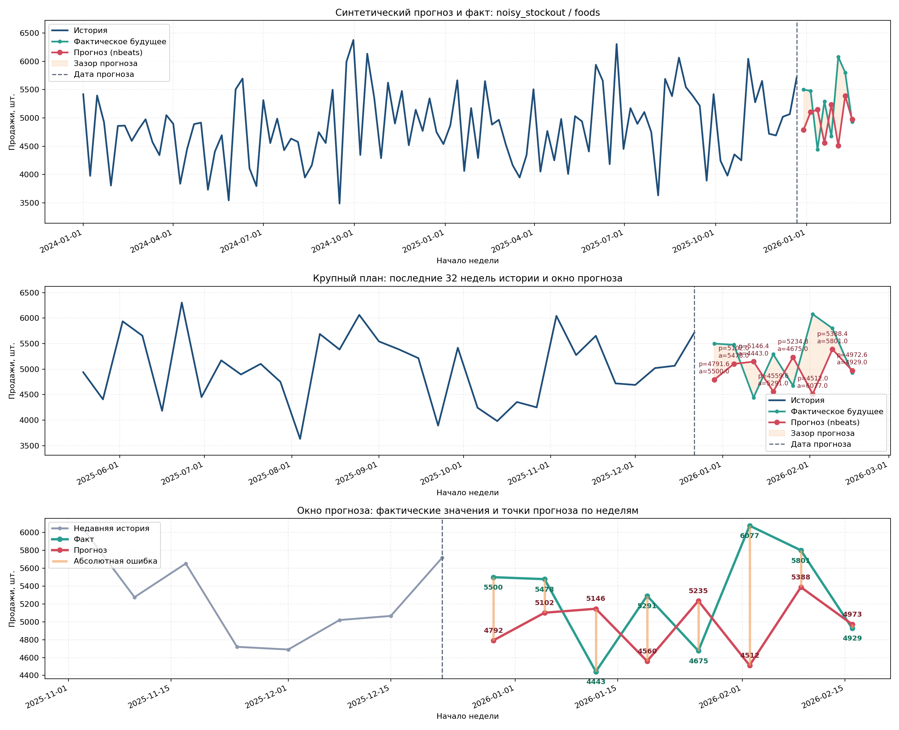
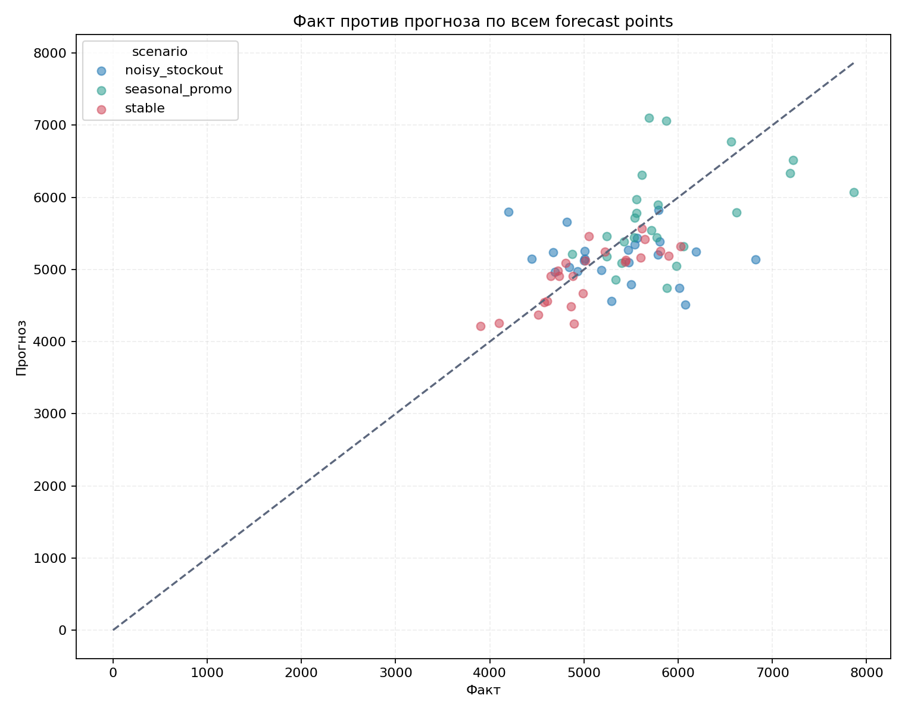
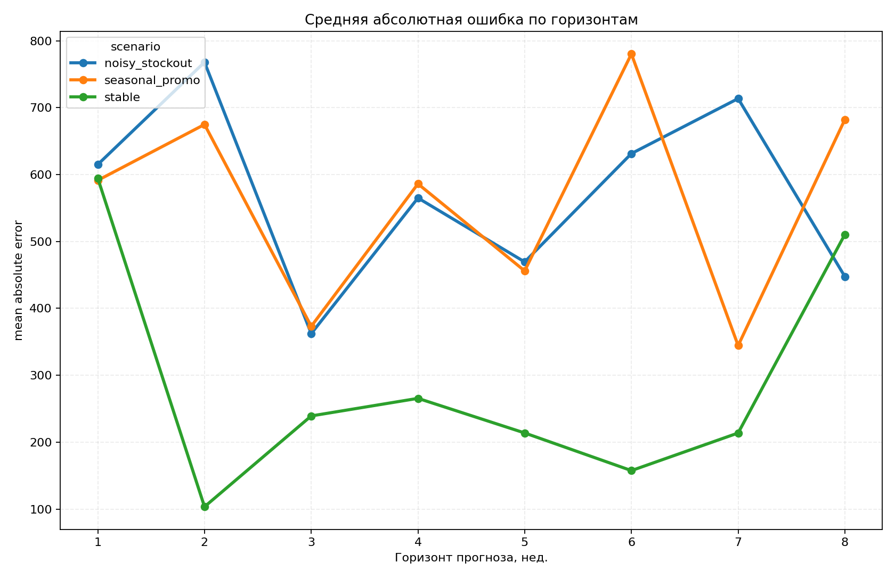
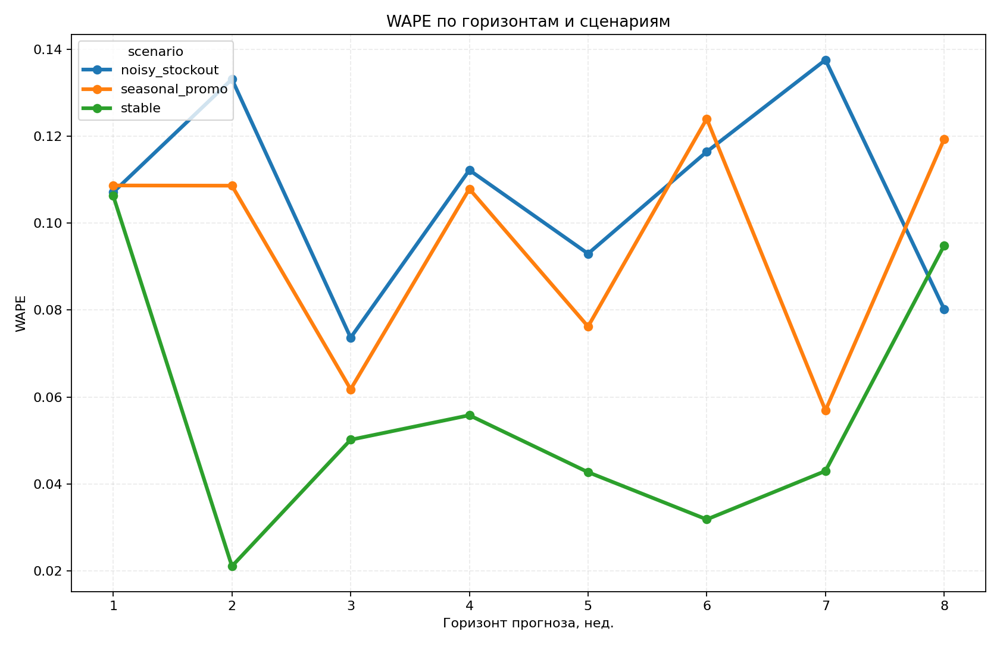

# Predict на synthetic данных

Разбор запуска `mt predict` на synthetic датасете.

[manifests/predict_synthetic.yaml](./manifests/predict_synthetic.yaml) и артефакты [artifacts/predict_synthetic](./artifacts/predict_synthetic)

## Постановка

| Что                           | Значение                                                                                             |
|-------------------------------|------------------------------------------------------------------------------------------------------|
| Входные данные                | [artifacts/synthetic/dataset/synthetic.csv](./artifacts/synthetic/dataset/synthetic.csv)             |
| Target                        | `sales_units`                                                                                        |
| Частота                       | неделя                                                                                               |
| Уровень агрегации для predict | `category`                                                                                           |
| Источник модели               | [artifacts/experiment_category/models/best_model](./artifacts/experiment_category/models/best_model) |
| Выбранная модель              | `mlp` по fit report                                                                                  |
| Горизонт прогноза             | 8 недель                                                                                             |
| Сценарии                      | `stable`, `seasonal_promo`, `noisy_stockout`                                                         |

Берем уже обученную category-модель и проверяем, как она ведет себя на synthetic данных с известными сценариями

## Где смотреть

- Манифест: [manifests/predict_synthetic.yaml](./manifests/predict_synthetic.yaml)
- Сводка датасета predict: [artifacts/predict_synthetic/dataset/dataset_summary.md](./artifacts/predict_synthetic/dataset/dataset_summary.md)
- Отфильтрованный датасет: [artifacts/predict_synthetic/dataset/filtered_dataset.csv](./artifacts/predict_synthetic/dataset/filtered_dataset.csv)
- Прогноз: [artifacts/predict_synthetic/forecast/predictions.csv](./artifacts/predict_synthetic/forecast/predictions.csv)
- Метрики: [artifacts/predict_synthetic/forecast/metrics_by_horizon.csv](./artifacts/predict_synthetic/forecast/metrics_by_horizon.csv)
- Краткий report: [artifacts/predict_synthetic/forecast/README.md](./artifacts/predict_synthetic/forecast/README.md)
- Лог запуска: [artifacts/predict_synthetic/run/run_catalog.csv](./artifacts/predict_synthetic/run/run_catalog.csv)
- Источник лучшей модели: [artifacts/experiment_category/models/best_model](./artifacts/experiment_category/models/best_model)

## Ключевые метрики по датасету predict

| Метрика                      | Значение  |
|------------------------------|-----------|
| rows                         | 1 944     |
| series_count                 | 3         |
| сценариев                    | 3         |
| category series per scenario | 3         |
| future rows                  | 72        |
| прогнозных строк             | 72        |
| scenario forecast rows       | по 24     |
| pipeline wall time           | 25.69 sec |

Тут важный момент: `series_count = 3` в summary означает три category-series (`foods`, `household`, `hobbies`).
Но с учетом трех сценариев по факту прогноз строится на 9 комбинаций `scenario x category`.

## Сводка по качеству

| Сценарий         | Средний WAPE | Средний sMAPE | Средний MAE | Комментарий               |
|------------------|-------------:|--------------:|------------:|---------------------------|
| `stable`         |       0.0557 |        5.6925 |      287.30 | лучший сценарий, ожидаемо |
| `seasonal_promo` |       0.0954 |        9.3086 |      561.04 | средний уровень сложности |
| `noisy_stockout` |       0.1066 |       10.8102 |      571.50 | самый тяжелый сценарий    |

Лучшее наблюдение по артефактам: `stable`, горизонт `2`, `WAPE = 0.0211`.

## Метрики по горизонтам

| Сценарий         | H1 WAPE | H2 WAPE | H8 WAPE |
|------------------|--------:|--------:|--------:|
| `stable`         |  0.1063 |  0.0211 |  0.0949 |
| `seasonal_promo` |  0.1087 |  0.1086 |  0.1193 |
| `noisy_stockout` |  0.1071 |  0.1331 |  0.0802 |

На `stable` модель местами попадает очень хорошо, на шумных сценариях разброс заметно больше.
Это норм, потому что synthetic специально так устроен.

## Этапы

### 1. Проверка входной постановки

Что проверяли:

- откуда берется модель
- какой target и какой уровень агрегации
- какой горизонт нужен

Что получили:

- входной dataset synthetic
- модель берется из category experiment artifacts
- прогноз делается на 8 недель вперед

### 2. Проверка данных перед прогнозом

Что проверяли:

- наличие `is_history`
- набор колонок в filtered dataset
- число рядов и сценариев

Что получили:

- `filtered_dataset.csv` содержит `scenario_name`, `category`, `week_start`, `is_history`, `sales_units`, `price`, `promo_planned`
- 1 944 строки
- 3 category-series, повторенные на 3 сценариях
- 72 future rows для оценки

### 3. Проверка совместимости модели и synthetic данных

Что проверяли:

- совпадает ли уровень агрегации
- хватает ли ковариат
- нет ли явного конфликта по схеме

Что получили:

- в `dataset_metadata.json` у лучшей модели указан `aggregation_level = category`
- synthetic predict dataset тоже приведен к category
- `price` и `promo_planned` доступны

### 4. Проверка самого прогноза

Что проверяли:

- число forecast rows
- покрытие по сценариям
- метрики по горизонтам

Что получили:

- 72 прогнозных строки
- по 24 строки на сценарий
- лучший сценарий `stable`, самый тяжелый `noisy_stockout`

### 5. Проверка риска утечки и интерпретации

Что проверяли:

- что сравнение идет только на future actual
- нет ли прямого использования target из будущего
- согласованы ли отчеты по имени модели

Что получили:

- split по `is_history` есть, это норм
- будущее отделено явно
- с моделями какие то ошибки надо будет поправить позже

## Картинки

Overlay прогноза:



Факт против прогноза:



Ошибка по горизонтам:



WAPE по сценариям и горизонтам:



## Как запускать

```bash
mt predict --manifest manifests/predict_synthetic.yaml
```

Результат:

```bash
artifacts/predict_synthetic
```

## Основные метрики простыми словами

| Метрика    | Как читать                                                             |
|------------|------------------------------------------------------------------------|
| `WAPE`     | доля суммарной ошибки от суммарного факта, ниже лучше                  |
| `sMAPE`    | симметричная процентная ошибка, удобна когда масштабы рядов отличаются |
| `MAE`      | средняя абсолютная ошибка в штуках                                     |
| `RMSE`     | как `MAE`, но сильнее штрафует большие промахи                         |
| `Bias`     | систематическое завышение или занижение, минус значит чаще недопрогноз |
| `MedianAE` | типичная абсолютная ошибка, менее чувствительна к выбросам             |

## Итог

Что можно считать подтвержденным:

- predict pipeline на synthetic данных работает end-to-end
- split по history/future сделан честно
- category-level модель лучше ведет себя на `stable`, хуже на `noisy_stockout`
- synthetic стенд годится для быстрого чека модели
