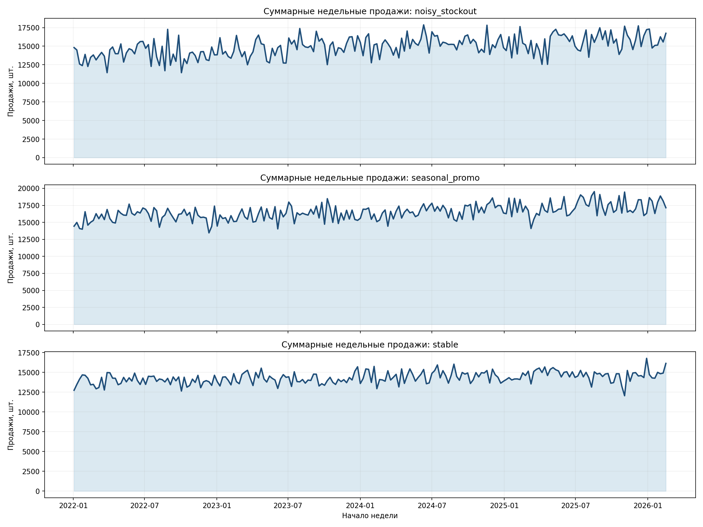
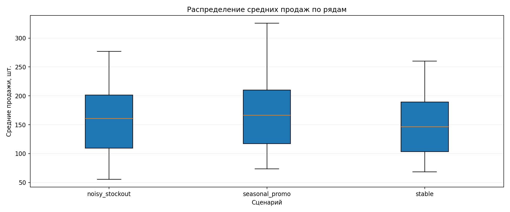
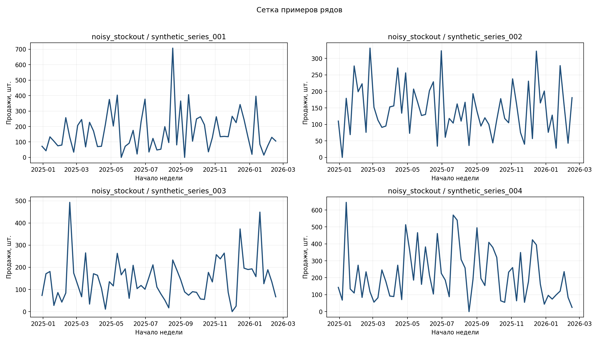

# Генерация synthetic данных

Тут зафиксирована генерация синтпетического недельного retail-датасета

[manifests/synthetic.yaml](./manifests/synthetic.yaml) и артефакты [artifacts/synthetic](./artifacts/synthetic).

## Постановка

| Что               | Значение                                     |
|-------------------|----------------------------------------------|
| Данные            | synthetic weekly retail dataset              |
| Target            | `sales_units`                                |
| Частота           | неделя, `W-MON`                              |
| Уровень агрегации | исходно series-level synthetic rows          |
| Период            | `2022-01-03` - `2026-02-16`                  |
| История           | 208 недель                                   |
| Future actual     | 8 недель                                     |
| Рядов             | 96                                           |
| Сценарии          | `stable`, `seasonal_promo`, `noisy_stockout` |
| Категории         | `foods`, `household`, `hobbies`              |

На ней можно быстро проверить pipeline, не ждать тяжелый реальный прогон и отдельно контролировать свойства спроса

## Где смотреть

- Манифест: [manifests/synthetic.yaml](./manifests/synthetic.yaml)
- Датасет: [artifacts/synthetic/dataset/synthetic.csv](./artifacts/synthetic/dataset/synthetic.csv)
- Краткое описание: [artifacts/synthetic/dataset/README.md](./artifacts/synthetic/dataset/README.md)
- Профиль: [artifacts/synthetic/preview/dataset_profile.csv](./artifacts/synthetic/preview/dataset_profile.csv)
- Словарь колонок: [artifacts/synthetic/preview/data_dictionary.csv](./artifacts/synthetic/preview/data_dictionary.csv)
- Превью и графики: [artifacts/synthetic/preview](./artifacts/synthetic/preview)
- Лог запуска: [artifacts/synthetic/run/run_catalog.csv](./artifacts/synthetic/run/run_catalog.csv)

## Ключевые моменты

| Метрика                | Значение |
|------------------------|----------|
| `number_of_rows`       | 62 208   |
| `history_rows`         | 59 904   |
| `future_rows`          | 2 304    |
| `number_of_series`     | 96       |
| `number_of_scenarios`  | 3        |
| `number_of_categories` | 3        |
| `mean_sales_units`     | 158.96   |
| `zero_share`           | 0.95%    |
| `promo_share`          | 14.65%   |
| pipeline wall time     | 2.09 sec |

## Распределение

| Срез                           | Что получилось               |
|--------------------------------|------------------------------|
| По сценариям                   | по 20 736 строк на сценарий  |
| По категориям                  | по 20 736 строк на категорию |
| Future по сценарию и категории | по 256 строк                 |
| История на один ряд            | 208 недель                   |
| Future на один ряд             | 8 недель                     |

Это норм, потому что сетка ровная и без перекоса. Для отладки это удобно

## Этапы

### 1. Проверка постановки генератора

Что проверяли:

- календарь, горизонт, число рядов
- диапазоны базового уровня, тренда, сезонности
- включение промо, цены, шума, выбросов и stockout-эффекта

Что получили:

- недельный календарь `W-MON`
- 96 рядов, 208 недель истории и 8 недель future actual
- три сценария с разной сложностью;ъ
- цена и промо заданы как `known_in_advance`

### 2. Проверка структуры таблицы

Что проверяли:

- число строк
- полноту ключей `scenario_name`, `series_id`, `week_start`
- наличие флага `is_history`
- типы и роли колонок

Что получили:

- 62 208 строк без дыр по основным служебным полям
- `is_history` заполнен везде
- `sales_units` помечен как `target`
- `price` и `promo_planned` помечены как `known_in_advance`

### 3. Проверка ровности и полноты сетки

Что проверяли:

- равномерность строк по сценариям и категориям
- число history/future строк
- длину истории на ряд

Что получили:

- распределение ровное
- по каждому сценарию и категории одинаковый объем future
- history/future соотносятся как ожидалось по манифесту

### 4. Проверка содержимого target и ковариат

Что проверяли:

- долю нулей
- долю промо
- наличие ценовой и промо-информации заранее
- сценарную вариативность на графиках

Что получили:

- нулей мало, `0.95%`
- промо встречается умеренно, `14.65%`
- цена и промо доступны заранее
- на графиках видно, что `stable` спокойнее, `seasonal_promo` волнообразнее, `noisy_stockout` шумнее

### 5. Проверка на утечки

Что проверяли:

- какие поля доступны заранее
- где hidden/internal поля
- как размечено будущее

Что получили:

- `price` и `promo_planned` допустимы
- `expected_sales_units` использовать нельзя
- `is_history=False` есть только для future actual

## Картинки

Сценарный пример:



Распределение продаж:



Сетка примеров рядов:



## Как запускать

```bash
mt generate-synthetic --manifest manifests/synthetic.yaml
```

Результат:

```bash
artifacts/synthetic
```

## Основные метрики простыми словами

| Метрика            | Как читать                                                  |
|--------------------|-------------------------------------------------------------|
| `number_of_rows`   | общий размер таблицы                                        |
| `history_rows`     | сколько строк можно брать как прошлое                       |
| `future_rows`      | сколько future actual оставлено для честной проверки        |
| `zero_share`       | сколько нулевых продаж, важно для intermittent demand       |
| `promo_share`      | насколько часто есть промо-сигнал                           |
| `mean_sales_units` | средний масштаб target, нужен чтобы понимать уровень ошибки |

## Итог

- synthetic датасет собран ровно и без явных структурных проблем;
- постановка под weekly forecasting норм;
- есть контролируемая сложность по сценариям;
- цена и промо можно использовать без явной утечки.
